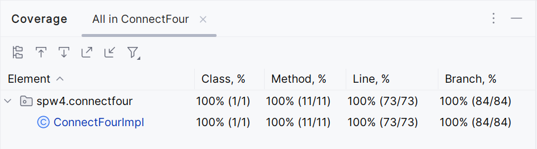
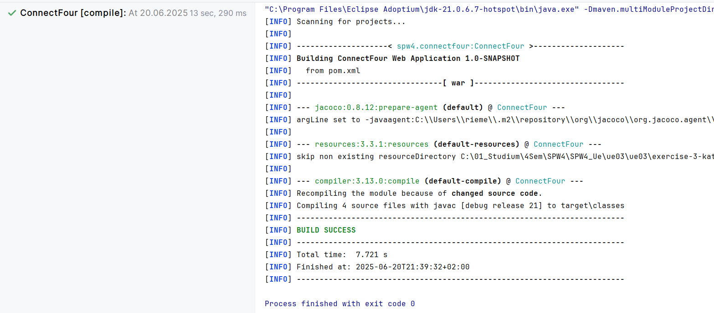
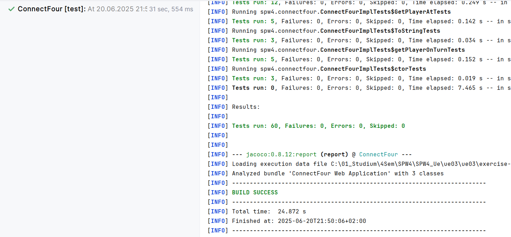
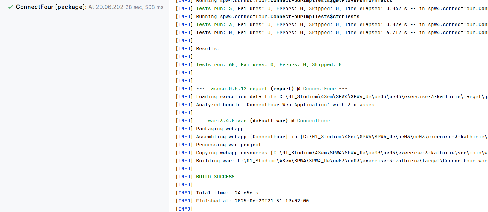
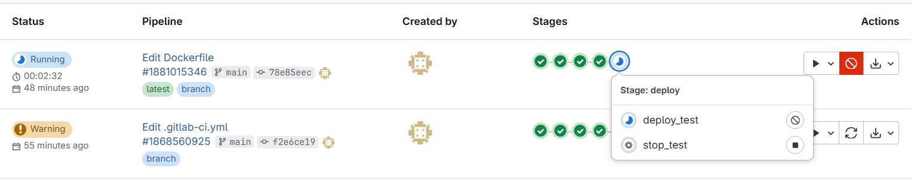
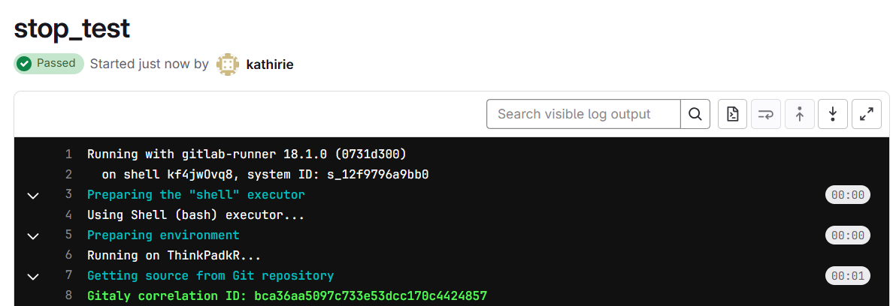
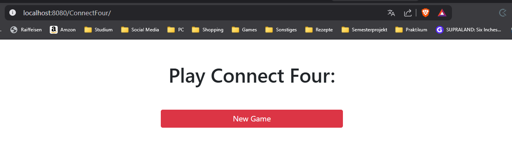
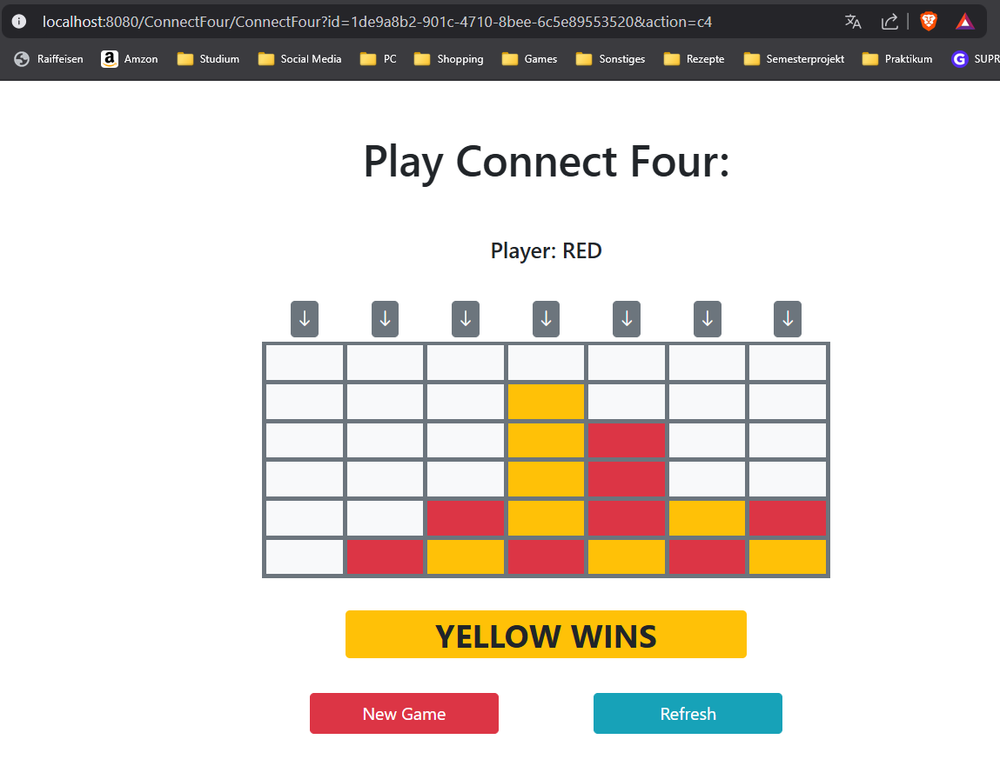
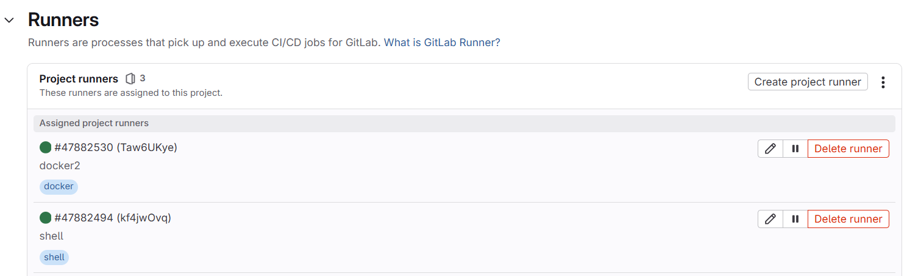

SPW4 - Exercise 3
=================

Name: _____________

Effort in hours: __

## 1. Connect Four Web Application and CI/CD Pipeline

### Task 1.a

I added the implementation as well as the tests.

here is the test coverage

here is the first goal (mvn compile)

here is the second goal (mvn test)

here is the third goal (mvn package)

### Task 1.b

Most of the programming was done in the lesson. I spent an uncomfortable amount of time on recreating the runners 
and some bug fixing but I managed to make the pipeline do what it was supposed to do.

The pipeline now works as expected

Deployment can also be stoped

Game is reachable

Game is also working

Runners are running (had to make another docker runner, couldn't delete the old one)

### Task 1.c

<!--- describe your solution here --->
